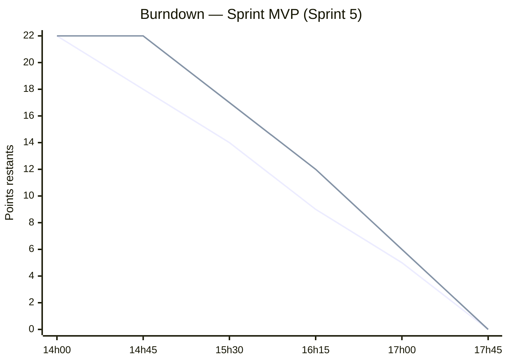
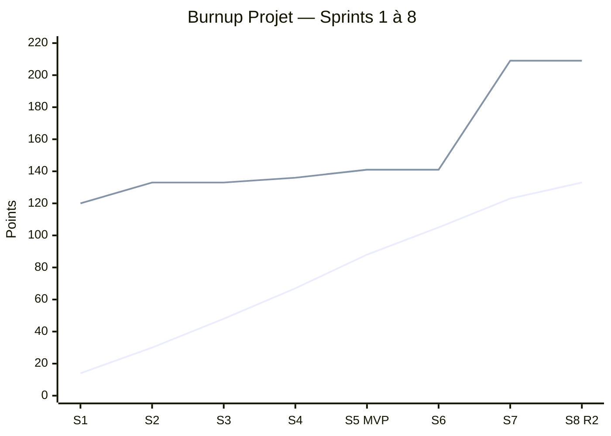

# Burndown & Burnup — Pilotage par les faits (J4)

## 🗂️ Identification du document

| | |
|---|---|
| **Équipe** | n° 6 |
| **Membres** | Kahil MOKHTARI · Amine HADDANE · Souleymane FALL · Nikola MILOSAVLJEVIC · Dina CHAOUKI · Rayan ZEBAZE SAO · Hugo RAGUIN |
| **Artefact** | Courbes de pilotage — Burndown (sprint) + Burnup (projet) |
| **Version** | v1.0 |
| **Date** | 02/07/2026 |
| **Statut** | ✅ Suivi tenu quotidiennement |
| **Rédacteur** | Nikola MILOSAVLJEVIC |

> Liens : [Perturbation J4](../perturbations/j4-passage-echelle.md) · [Release Planning](release-planning.md) · [Sprint Backlog](sprint-backlog.md).

---

## 1. Burndown — Sprint MVP (Sprint 5, mer. 14h–17h45)

**Engagement du sprint : 22 points.** Reste-à-faire relevé à chaque point de contrôle, comparé à la ligne idéale.

| Point de contrôle | Idéal (reste) | Réel (reste) | Commentaire |
|---|:--:|:--:|---|
| 14h00 (début) | 22 | 22 | Démarrage du sprint |
| 14h45 | 18 | 22 | Mise en route (env., relecture) |
| 15h30 | 14 | 17 | Rattrapage du retard initial |
| 16h15 | 9 | 12 | **Perturbation J3-bis (SAR RGPD) absorbée** |
| 17h00 | 5 | 6 | Quasi sur la ligne idéale |
| 17h45 (fin) | 0 | 0 | ✅ **MVP livré** (tag `v1.0.0-mvp`) |

**Lecture** : démarrage plus lent que l'idéal (mise en route), puis rattrapage ; la perturbation **J3-bis** insérée en cours de sprint a été **absorbée sans décaler la fin**. Reste-à-faire ramené à **0** à 17h45.

---

## 2. Burnup — Projet (Sprints 1 → 8)

Le burnup distingue **deux courbes** : le **réalisé cumulé** (ce qui est terminé) et le **périmètre total** (qui **augmente** à chaque perturbation ajoutant du scope). L'écart final = travail restant au-delà de la semaine.

| Sprint | Réalisé (pts) | **Réalisé cumulé** | **Périmètre total** | Perturbation / impact périmètre |
|---|:--:|:--:|:--:|---|
| S1 | 14 | 14 | 120 | — |
| S2 | 16 | 30 | 133 | **J1 : +13** (épic Espace enseignant E13) |
| S3 | 18 | 48 | 133 | J2 : +0 (choix technique, retravail interne) |
| S4 | 19 | 67 | 136 | **J3 : +3** (sécurité E7) |
| S5 | 21 | 88 | 141 | **J3-bis : +5** (RGPD E8) → 🎯 **MVP (R1)** |
| S6 | 17 | 105 | 141 | J4 : retour client (retravail) |
| S7 | 18 | 123 | **209** | **J4 passage à l'échelle : +68** (RGAA E15 / i18n E16 / scalabilité E14) |
| S8 | 10 | 133 | 209 | Stabilisation ; 🚀 R2 livrée |

**Lecture** :

- La courbe **réalisé cumulé** progresse régulièrement (vélocité ~14–21 pts/sprint), ce qui valide un rythme soutenable.
- La courbe **périmètre** fait **3 sauts visibles** dus aux perturbations : **J1 (+13)**, **J3/J3-bis (+8)** et surtout **J4 passage à l'échelle (+68)**.
- **Impact chiffré J4** : le périmètre bondit de **141 → 209 pts** (**+48 %**). À la fin de la semaine, **133/209 pts** sont réalisés : les **~76 pts** de RGAA/i18n/scalabilité constituent une **Release 3 « Plateforme publique »** planifiée **au-delà** de la semaine — c'est l'effet attendu de la perturbation, rendu **visible et chiffré** plutôt que subi.

---

## 3. Synthèse de l'impact des perturbations sur le périmètre *(pilotage par les faits)*

| Perturbation | Scope ajouté (pts) | Absorbée dans | Effet |
|---|:--:|---|---|
| **J1** — persona Mme Lefèvre | +13 | R1 (must-have remonté) | Espace enseignant intégré au MVP |
| **J2** — latence LLM | 0 (retravail) | S3 | Bascule `mistral:7b` (ADR-0001) |
| **J3** — prompt injection | +3 | S4 | Garde 4 couches (E7) |
| **J3-bis** — SAR RGPD | +5 | S5 | Export + rétention (E8) |
| **J4** — passage à l'échelle | **+68** | **R3 (au-delà)** | RGAA + i18n + scalabilité planifiés |

> Règle de pilotage : on ne « cache » pas un scope ajouté dans la vélocité — on le **matérialise sur le burnup** et on **replanifie** (Release 3), conformément à la consigne « un plan clair, pas du code dans la panique ».

---

## 📚 Références

- [Perturbation J4 — passage à l'échelle](../perturbations/j4-passage-echelle.md) · [Release Planning](release-planning.md) · [Product Backlog](product-backlog.md).

---

*Burndown & Burnup — équipe 6. Burndown : MVP livré à 0 reste-à-faire ; Burnup : périmètre +68 pts en J4 (+48 %), replanifié en Release 3.*
